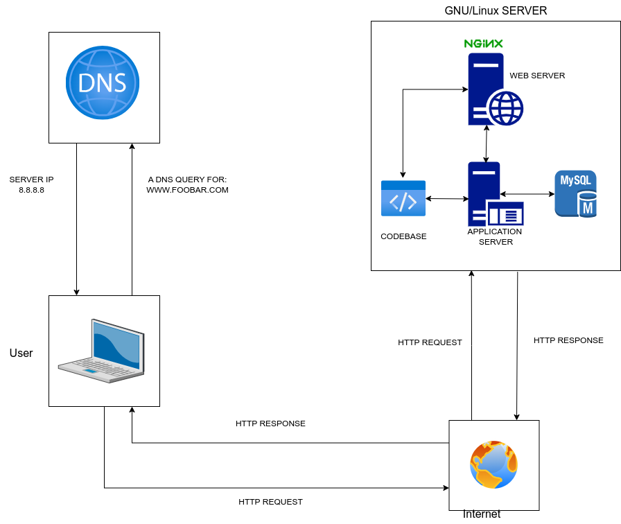
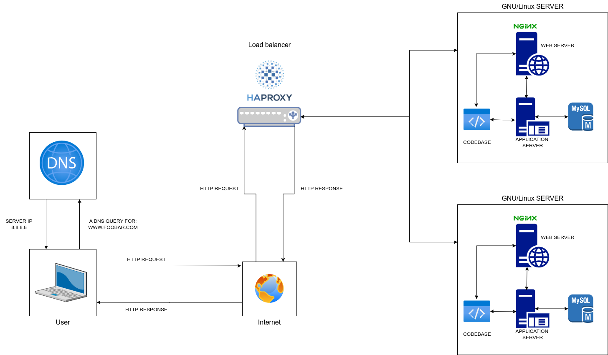
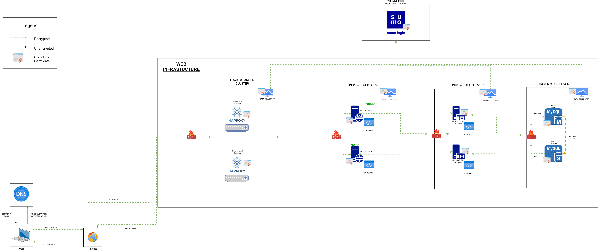

# 0x09-web_infrastructure_design

## 0. Simple web stack

### Specifics about this infrastructure:

- **What is a server**
    
    It’s a computer or a system that manages resources and provide services to other computers (clients) over the network.
    
- What is the role of the domain name
    
    It provides a user-friendly way to access a website.
    
- What type of DNS record `www` is in `www.foobar.com`
    
    It is a canonical name `CNAME` record that points to the primary domain `foobar.com`
    
- What is the role of the web server
    
    Hosts a site and processes client HTTP requests from users’ browsers. It serves static and dynamic content over the internet.
    
- What is the role of the application server
    
    Provide access to business logic and generates dynamic content and handles the complex operations, interacts with the database to fetch or store data.
    
- What is the role of the database
    
    Create, retrieve, update, delete, and manage the data. It provides structure for the business infromation. 
    

### **What the issues are with this infrastructure:**

- SPOF
    
    Having a one of each of, server, application server, webserver, and database, introduces multiple “single” points of failure as there is no redundancy to prevent inaccessability and potential downtime in case of any of the modules of the server goes down.
    
- Downtime when maintenance needed (like deploying new code web server needs to be restarted)
    
    When any maintenance is needed, there is no backup server or secondary server to process requests until the necessary updates are made. 
    
- Cannot scale if too much incoming traffic

## 1. Distributed web infrastructure

### Specifics about this infrastructure:

- For every additional element, why you are adding it
    
    By having an additional server we will decrease the possibility of having a single point of failure by adding redundancy and increase the availability of the service.
    
    The addition of the load balancer will distribute traffic among different servers, and decrease workload on the main server in addition to scaling the reliability and the performance of the service.
    
- What distribution algorithm your load balancer is configured with and how it works
    
    Round-robin algorithm: this algorithm distributes traffic among numerous servers sequentially.
    
- Is your load-balancer enabling an Active-Active or Active-Passive setup, explain the difference between both
    
    Active-active setup
    
    Active-active setup: All servers are all available and online, expecting traffic to be forwarded to them using one of the scheduling algorithms.
    
    Active-passive setup: the passive server is only online and used when the active server fails, so the load balancer will direct all traffic to the passive server, this setup is used in the failover and disaster recovery.
    
- How a database Primary-Replica (Master-Slave) cluster works
    
    The Primary node (The Master) accepts both read and write operations, wheres the replica handles the read operations and mirrors the primary node data. Whenever the data gets updated in the primary node it gets rippled through all other slaves.
    
- What is the difference between the Primary node and the Replica node in regard to the application
    
    The primary node which is also referred to as the master node, and it maintains the authoritative copy of the data, while the replica node often referred to as the slave, and it maintains a copy of the primary node data for read operations.
    

### Issues are with this infrastructure:

- Where are SPOF
    
    Having a single load balancer in the infrastructure design, can prone the system to a “single” point of failure since there’s no redundancy in the part of redirecting traffic to the corresponding server.
    
    Having a monolithic architecture of the infrastructure design where all the server components are clustered and dependent on each other sharing the same resources is considered multiple “single” points of failure. 
    
- Security issues (no firewall, no HTTPS)
    
    Without using encryption methods credentials theft could happen, as well as data tempering. Firewalls prevent unauthorized access which can occur in this current design.
    
- No monitoring
	
	Having no monitoring will prevent visualization of the different parts of the system, and it makes it difficult to identify any issues promptly

## 2. Secured and monitored web infrastructure

### Specifics about this infrastructure:

- For every additional element, why you are adding it
    - 3 Firewalls: The addition of the Firewalls is to provide security and filter and control incoming and outgoing traffic.
    - SSL certificate: Providing encryption for the incoming and outgoing data and also authenticate the identity of the website.
    - Monitoring clients: This was added to collect server data on performance, errors and other metrics to identify and resolve issues.

- What are firewalls for
    
    Firewalls are used to prevent unauthorized access and identify cyber attacks based on established threats.
    
- Why is the traffic served over HTTPS
    
    The HTTPS encrypts data during transmission either using SSL/TLS, therefore provides secure communication between the client and the server.
    
- What monitoring is used for
    
    They are used to track analyse server performance and identify any potential issue, to ensure availability, efficiency and reliability
    
- How the monitoring tool is collecting data
    
    Monitoring clients use data collectors to gather metrics from various components such as the server resources, the application performance and network activity, which are then sent to the centralized monitoring service for analysis and reporting.
    
- Explain what to do if you want to monitor your web server QPS
    1. Using the log aggregation system to collect HTTP request log event data from the web server and based on this data, we can represent a gauge to track the number of HTTP request per second or the QPS.
    2. Set up alerts based on predefined threshold to notify the monitoring admin of any potential issues or unexpected patterns.

### Issues are with this infrastructure:

- Why terminating SSL at the load balancer level is an issue
    
    SSL termination means that the SSL connection is decrypted at the load balancer, and the traffic between the load balancer and the backend servers is unencrypted.
    
    This can be a concern for sensitive data transmission over untrusted networks.
    
- Why having only one MySQL server capable of accepting writes is an issue
    
    It is a single point of failure for the write operation, meaning if the MYSQL server fails, the write operations cannot proceed.
    
- Why having servers with all the same components (database, web server and application server) might be a problem
    
    By having a monolithic architecture where all components share the same resources, the system will be susceptible for failure if any part of it stops working.
    
    Also, it can pose several challenges and potential issues during scalability and maintainability.

## 3. Scale up
### Specifics about this infrastructure:

- For every additional element, why you are adding it
    
    1 Server: adding a new server with it’s own independent components will add redundancy and high availability to the design and ensures scalability if the number of users or the data increases without having to increase costs and add a complete web stack cluster set.
    
    Load Balancer: Having a fall over load balancer will add redundancy as it increases fault tolerance. If one load balancer required maintenance or encountered issues, the backup will step over to handle traffic distribution.
