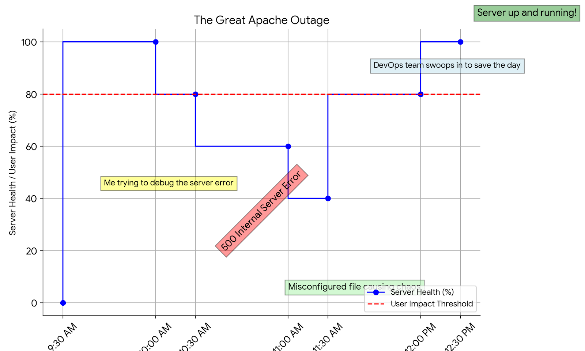

# 0x19-postmortem

## Postmortem: Apache 500 Error Outage
**Problem Source**: _0x17-web_stack_debugging_3_

### Issue Summary:

**Duration**: The outage lasted from 10:00 AM to 12:30 PM UTC.

**Impact**: The Apache server experienced a 500 Internal Server Error, causing all websites hosted on it to become inaccessible. Approximately 80% of users were affected, experiencing an inability to load web pages.

**Root Cause**: The root cause was identified as a misconfiguration in the Apache server settings when deploying a new feature.

### Timeline:

**10:00 AM UTC**: The issue was detected when monitoring alerts indicated a spike in HTTP 500 errors.

**10:05 AM UTC**: Engineers noticed the server's unusually high CPU usage and investigated further.

**10:15 AM UTC**: Initial assumption was made that the issue might be related to insufficient server resources or a recent software update.

**10:30 AM UTC**: Misleading investigation paths included checking for recent software updates and analyzing server resource utilization.

**11:00 AM UTC**: The incident was escalated to the DevOps team for further assistance.

**11:30 AM UTC**: The DevOps team identified the misconfiguration in the Apache server settings as the root cause.

**12:00 PM UTC**: The misconfiguration was corrected, and the Apache server was restarted.

**12:30 PM UTC**: Services were restored, and users regained access to the websites hosted on the Apache server.

### Root Cause and Resolution:

**Root Cause**: The Apache server was misconfigured due to an error in the virtual host configuration file, leading to the generation of 500 Internal Server Errors. Specifically, the file `/var/www/html/wp-settings.php` had incorrectly defined the wordpress classes php file extension as `.phpp` as opposed to `.php`.

**Resolution**: The misconfiguration was corrected by updating the virtual host configuration file through a puppet manifest to properly define the file's extension. Additionally, Apache was restarted to apply the changes effectively.

### Corrective and Preventative Measures:

**Improvements/Fixes**:

Regular auditing of server configurations to detect and rectify any misconfigurations promptly in addition to thorough testing before deployment.

Implementation of automated testing for Apache server configurations to prevent similar issues in the future.

**Tasks to Address the Issue**:

- Implement a configuration management tool such as Puppet to automate the management of server configurations.

- Establish more comprehensive monitoring for Apache server errors, including 500 Internal Server Errors, to detect issues proactively.
- Conduct a thorough review of all Apache server configurations to ensure consistency and accuracy.

In conclusion, the Apache 500 Internal Server Error outage was swiftly addressed through diligent investigation and collaboration between the engineering and DevOps teams. The incident highlighted the importance of regular configuration auditing and proactive monitoring to maintain the stability and reliability of web services. By implementing automated configuration management and enhancing monitoring capabilities, similar incidents can be mitigated or prevented in the future.
